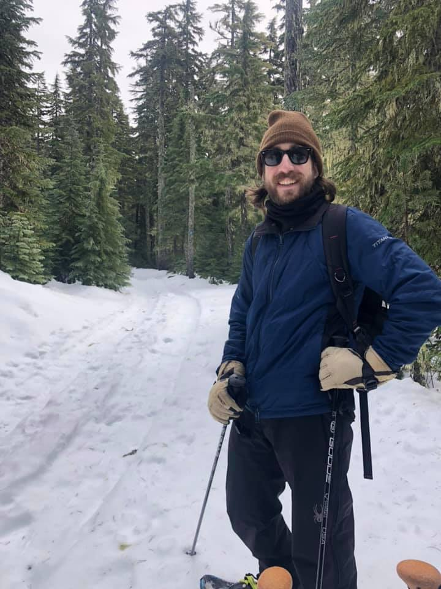

```{r setup, include=FALSE}
knitr::opts_chunk$set(echo = FALSE)
```


I received my Cognitive Neuroscience PhD from the University of Oregon in March 2023. My research focused on using machine learning, statistics, and computer vision methods to understand learning.

```{r}

```
